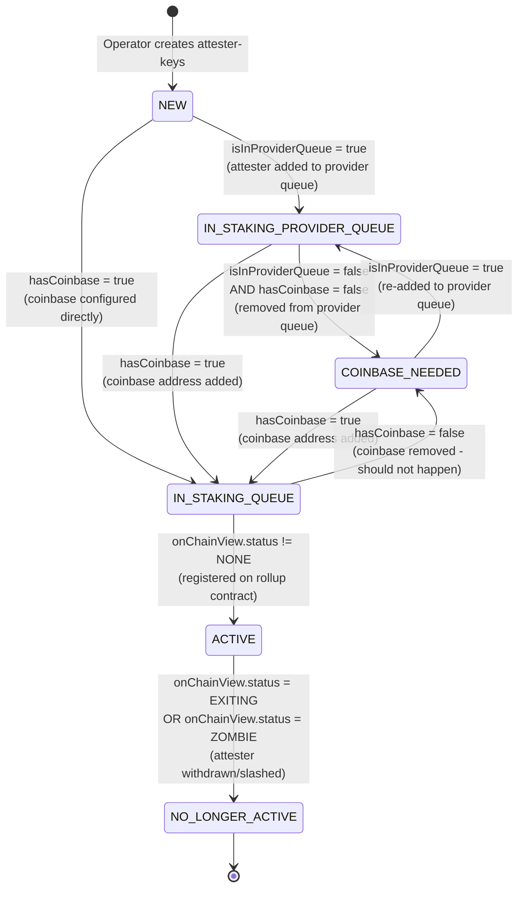

# Aztec Butler

A tool for helping out with managing multiple aztec nodes with an opinionated workflow and set-up.

## Requirements

- **Node.js v22.0.0 or higher**

## Attester State Diagram

**State Descriptions:**

- **NEW**: Initial state for newly discovered attesters with no configuration
- **IN_STAKING_PROVIDER_QUEUE**: Attester is in the staking provider's queue waiting for coinbase assignment
- **COINBASE_NEEDED**: Attester was removed from provider queue and needs a coinbase address to proceed
- **IN_STAKING_QUEUE**: Attester has coinbase configured and is waiting to be registered on-chain
- **ACTIVE**: Attester is actively validating on the rollup contract (status = VALIDATING)
- **NO_LONGER_ACTIVE**: Attester has been withdrawn or slashed (terminal state)

**Key Events:**

- `hasCoinbase`: Attester has a coinbase address configured in the scraper config
- `isInProviderQueue`: Attester address exists in the staking provider's queue array
- `onChainView.status`: On-chain status from rollup contract (NONE, VALIDATING, ZOMBIE, EXITING)

See [src/server/state/index.ts](./src/server/state/index.ts) and [src/server/state/transitions.ts](./src/server/state/transitions.ts) for implementation details.

## Documentation

- **[Operator Guide](./operator-guide/README.md)** - Complete guide for validator key management (generate, deploy, register)
- **[Daemon Setup](./daemon/README.md)** - Run aztec-butler as a systemd service with Prometheus metrics

## Running as a Service

To run aztec-butler as a systemd service, see the [daemon setup guide](./daemon/README.md). The daemon runs the butler in server mode, providing Prometheus metrics and automated monitoring for your Aztec nodes.

## TODO

1. double-check: there should be one command checking no duplicates of attester addresses across all positions on-chain
   - stakingProviderRegistryQueue
   - rollup entryQueue
   - rollup active validators

### Roadmap

1. replace need for aztecmonitor
   - P2P connection status
   - chain tips
1. merge attester-scraper and entry-queue stats scraper. (they both scrape from the same resource and can be done in one go)
