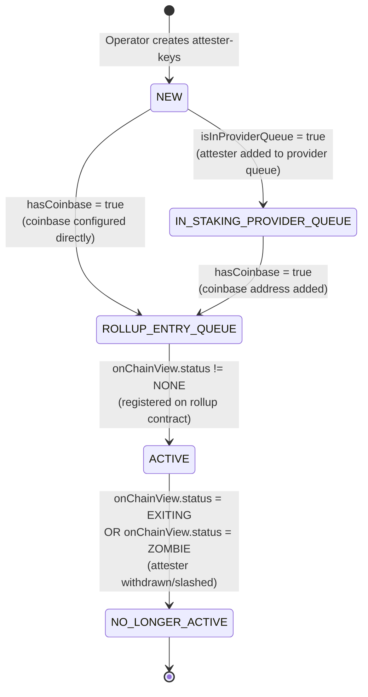

# Aztec Butler

A tool for helping out with managing multiple aztec nodes with an opinionated workflow and set-up.

## Requirements

- **Node.js v22.0.0 or higher**

## Attester State Diagram



**State Descriptions:**

- **NEW**: Initial state for newly discovered attesters with no configuration
- **IN_STAKING_PROVIDER_QUEUE**: Attester is in the staking provider's queue waiting for coinbase assignment
- **ROLLUP_ENTRY_QUEUE**: Attester has coinbase configured and is waiting to be registered on the rollup contract's entry queue
- **ACTIVE**: Attester is actively validating on the rollup contract (status = VALIDATING)
- **NO_LONGER_ACTIVE**: Attester has been withdrawn or slashed (terminal state)

**Key Events:**

- `hasCoinbase`: Attester has a coinbase address configured in the scraper config
- `isInProviderQueue`: Attester address exists in the staking provider's queue array
- `onChainView.status`: On-chain status from rollup contract (NONE, VALIDATING, ZOMBIE, EXITING)

**Note:** Tracking of attesters missing coinbase is now handled by the entry queue scraper via `providerNextMissingCoinbaseArrivalTimestamp` and `providerNextMissingCoinbaseAddress`.

See [src/server/state/index.ts](./src/server/state/index.ts) and [src/server/state/transitions.ts](./src/server/state/transitions.ts) for implementation details.

## Documentation

- **[Operator Guide](./docs/operator-guide/README.md)** - Complete guide for validator key management (generate, deploy, register)
- **[Daemon Setup](./daemon/README.md)** - Run aztec-butler as a systemd service with Prometheus metrics

## Configuration

### Unified Keys File Format

Aztec Butler uses a unified configuration format for both validator nodes and the monitoring server. Keys files follow the naming convention:

```
[network]-keys-[serverId]-v[version].json
```

Examples:

- `mainnet-keys-A-v1.json`
- `mainnet-keys-B-v2.json`
- `testnet-keys-validator1-v3.json`

**File structure:**

```json
{
  "schemaVersion": 1,
  "remoteSigner": "https://signer.example.com:8080",
  "validators": [
    {
      "attester": {
        "eth": "0x...",
        "bls": "0x..."
      },
      "coinbase": "0x...",
      "feeRecipient": "0x...",
      "publisher": "0x..."
    }
  ]
}
```

**Server Auto-Discovery:**

The monitoring server automatically discovers and merges all keys files matching the pattern `{network}-keys-*.json` in the data directory. For each server ID, only the highest version number is loaded to avoid conflicts.

**Workflow:**

1. **Generate keys files:**

   ```bash
   aztec-butler prepare-deployment \
     --production-keys existing-keys.json \
     --new-public-keys new-keys.json \
     --available-publishers publishers.json \
     --network mainnet
   ```

2. **Populate coinbase addresses:**

   ```bash
   # Scrape coinbase addresses from on-chain events
   aztec-butler scrape-coinbases --network mainnet

   # Fill coinbases into keys files
   aztec-butler fill-coinbases --network mainnet --keys-file mainnet-keys-A-v1.json
   ```

3. **Deploy:**

   ```bash
   # Copy keys files to monitoring server's data directory
   scp mainnet-keys-A-v1.json server:~/.local/share/aztec-butler/

   # Start monitoring server (auto-discovers keys files)
   aztec-butler start-server --network mainnet
   ```

**Note:** The `coinbase` field is optional in keys files. New validators created by `prepare-deployment` won't have coinbase addresses initially. Use the `fill-coinbases` command after running `scrape-coinbases` to populate them.

## Running as a Service

To run aztec-butler as a systemd service, see the [daemon setup guide](./daemon/README.md). The daemon runs the butler in server mode, providing Prometheus metrics and automated monitoring for your Aztec nodes.

## TODO

1. double-check: there should be one command checking no duplicates of attester addresses across all positions on-chain
   - stakingProviderRegistryQueue
   - rollup entryQueue
   - rollup active validators

### Roadmap

1. replace need for aztecmonitor
   - P2P connection status
   - chain tips
1. merge attester-scraper and entry-queue stats scraper. (they both scrape from the same resource and can be done in one go)
