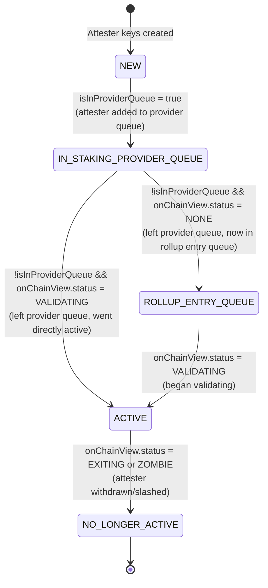

# Aztec Butler

A tool for helping out with managing multiple aztec nodes with an opinionated workflow and set-up.

## Requirements

- **Node.js v22.0.0 or higher**

## Development

### Running CLI Commands

The shell scripts in `scripts/` use `tsx` for TypeScript execution (compatible with Node.js v22):

```bash
# Run any script directly
./scripts/scrape-coinbases.sh --network mainnet
./scripts/get-queue-stats.sh --network mainnet

# Or run CLI commands directly with tsx
npx tsx cli.ts scrape-coinbases --network mainnet
npx tsx cli.ts get-queue-stats --network mainnet --json
```

### Building for Production

```bash
npm run build
npm start -- serve --network mainnet
```

## Agent Mode

The **agent** is the local, read-only sequencer telemetry process. It runs on
each sequencer host, reads that host's registered-key files, performs
read-only L1/L2 checks, and pushes metrics to a local OpenTelemetry collector
over OTLP. It runs no HTTP server and loads no private keys.

```bash
aztec-butler agent --network mainnet
```

Test it locally before deploying — no production access required:

```bash
scripts/agent-local-test.sh dry-run mainnet   # print metrics to stdout
scripts/agent-local-test.sh once mainnet      # export into a local OTLP collector
scripts/agent-local-test.sh logs              # inspect what arrived
```

See **[Agent Deployment Guide](./docs/agent-deployment.md)** for the full
configuration reference, metrics, Grafana queries and systemd deployment.

## Attester State Diagram


```mermaid
stateDiagram-v2
    [*] --> NEW: Attester keys created

    NEW --> IN_STAKING_PROVIDER_QUEUE: isInProviderQueue = true<br/>(attester added to provider queue)

    IN_STAKING_PROVIDER_QUEUE --> ROLLUP_ENTRY_QUEUE: !isInProviderQueue && onChainView.status = NONE<br/>(left provider queue, now in rollup entry queue)
    IN_STAKING_PROVIDER_QUEUE --> ACTIVE: !isInProviderQueue && onChainView.status = VALIDATING<br/>(left provider queue, went directly active)

    ROLLUP_ENTRY_QUEUE --> ACTIVE: onChainView.status = VALIDATING<br/>(began validating)

    ACTIVE --> NO_LONGER_ACTIVE: onChainView.status = EXITING or ZOMBIE<br/>(attester withdrawn/slashed)

    NO_LONGER_ACTIVE --> [*]
```

**State Descriptions:**

- **NEW**: Initial state for newly discovered attesters (not yet in any on-chain queue)
- **IN_STAKING_PROVIDER_QUEUE**: Attester address exists in the staking provider's queue on the staking contract
- **ROLLUP_ENTRY_QUEUE**: Attester has an on-chain view in the rollup contract with status = NONE (in global entry queue, waiting to become active)
- **ACTIVE**: Attester is actively validating on the rollup contract (status = VALIDATING)
- **NO_LONGER_ACTIVE**: Attester has been withdrawn or slashed (terminal state)

**State Transitions (purely on-chain):**

State transitions are determined exclusively by on-chain data:

- `isInProviderQueue`: Attester address exists in the staking provider's queue array (from staking contract)
- `onChainView`: Attester data from rollup contract (includes status and other attester info)
- `onChainView.status`: On-chain status from rollup contract (NONE, VALIDATING, ZOMBIE, EXITING)

**Coinbase Tracking (separate from state):**

Coinbase addresses are tracked separately for operational awareness but do not affect state transitions. The entry queue scraper reports which attesters are missing coinbase configuration via:

- `providerNextMissingCoinbaseArrivalTimestamp`: When the next attester without coinbase will reach the front of the queue
- `providerNextMissingCoinbaseAddress`: Address of that attester

See [src/server/state/index.ts](./src/server/state/index.ts) and [src/server/state/transitions.ts](./src/server/state/transitions.ts) for implementation details.

## Documentation

- **[Operator Guide](./docs/operator-guide/README.md)** - Complete guide for validator key management (generate, deploy, register)
- **[Daemon Setup](./daemon/README.md)** - Run aztec-butler as a systemd service with Prometheus metrics
- **[Agent Deployment Guide](./docs/agent-deployment.md)** - Run the local read-only telemetry agent with OTLP export

## Configuration

### Staking Registry Targeting

Proposal-related CLI commands support selecting which staking registry to target:

- `native` (default)
- `olla`

Supported commands:

- `add-keys`
- `get-provider-id`
- `get-create-staking-provider-calldata`
- `new-publisher-keys`
- `process-private-keys`
- `prepare-deployment`

Use `--registry <native|olla>` (defaults to `native` if omitted).

Example:

```bash
# Default (native)
aztec-butler get-provider-id 0xYourAdminAddress --network mainnet

# Explicit Olla target
aztec-butler get-provider-id 0xYourAdminAddress --network mainnet --registry olla
```

For Olla target support, configure:

```bash
OLLA_AZTEC_STAKING_REGISTRY_ADDRESS=0x...
OLLA_AZTEC_STAKING_PROVIDER_ADMIN_ADDRESS=0x...
OLLA_AZTEC_STAKING_PROVIDER_REWARDS_RECIPIENT_ADDRESS=0x... # optional; generate setter calldata when different from chain
OLLA_REWARDS_COINBASE_ADDRESS=0x...
```

If required Olla variables are missing for the selected command and `--registry olla` is used, the CLI fails fast with a clear error.

For `process-private-keys`, GCP Secret Manager naming uses Ethereum network naming derived from `ETHEREUM_CHAIN_ID` (not `NETWORK`):

- `1` -> `mainnet`
- `11155111` -> `sepolia`
- any other chain -> `chain-<id>`

Example: with `NETWORK=testnet` and `ETHEREUM_CHAIN_ID=11155111`, secrets are created as `web3signer-sepolia-...`.

Secret naming format:

- Attester keys (ETH/BLS): `web3signer-<network>-<eth|bls>-att-<id>-<publicKey>`
- Publisher keys (ETH, only when explicitly uploaded): `web3signer-<network>-eth-pub-<publicKey>`

`process-private-keys` uploads attester keys by default and skips publisher private keys generated by `aztec validator-keys new`. Use existing/source publisher addresses in `available_publisher_addresses.json`, generate fresh publishers with `new-publisher-keys`, or pass `--upload-publisher-keys` only when you intentionally want the input file's publisher private keys uploaded.

Publisher secrets are keyed by publisher public address (no validator index in the secret name), so shared publishers across multiple validators reuse the same secret.

`process-private-keys` is now interruption-safe for GCP secret uploads: if a secret exists for a key but has no enabled versions, rerunning the command appends the missing version instead of skipping it.

Duplicate checks for `add-keys` and `process-private-keys` are performed across both registries (where available), not only the selected target. If one registry is unavailable or unconfigured, Butler warns and continues checking the other registry.

### Olla ABI Sync

Olla ABI support is sourced from local `olla-core` artifacts via:

```bash
npm run sync:olla-abi
```

By default, the sync script reads from `../olla-core`. You can override this using `OLLA_CORE_PATH`.

Note: scraper support/refactors are intentionally out of scope for this change.

### Registered Keys File Format

Aztec Butler server discovery uses registered-key files grouped by network, host, and source:

```text
~/.local/share/aztec-butler/[network]/[host]/[source]-registered-keys.json
```

Examples:

- `~/.local/share/aztec-butler/mainnet/beast-3/native-registered-keys.json`
- `~/.local/share/aztec-butler/testnet/beast-5/native-registered-keys.json`
- `~/.local/share/aztec-butler/testnet/beast-5/olla-registered-keys.json`

Source identity:

- `native` uses the host as `serverId`, for example `beast-3`.
- Non-native sources include the source in `serverId`, for example `beast-5-olla`.

**File structure:**

```json
{
  "schemaVersion": 1,
  "remoteSigner": "https://signer.example.com:8080",
  "validators": [
    {
      "attester": {
        "eth": "0x...",
        "bls": "0x..."
      },
      "coinbase": "0x...",
      "feeRecipient": "0x...",
      "publisher": "0x..."
    }
  ]
}
```

**Server Auto-Discovery:**

The monitoring server automatically discovers and merges all registered-key files matching `{network}/*/*-registered-keys.json` in the data directory. This supports multiple registries or providers for the same host without flattening source identity into a custom filename.

**Workflow:**

1. **Generate keys files:**

   ```bash
   aztec-butler prepare-deployment \
     --production-keys existing-keys.json \
     --new-public-keys new-keys.json \
     --available-publishers publishers.json \
     --network mainnet
   ```

2. **Populate coinbase addresses:**

   ```bash
   # Scrape coinbase addresses from on-chain events
   aztec-butler scrape-coinbases --network mainnet

   # Fill coinbases into keys files
   aztec-butler fill-coinbases --network mainnet --keys-file mainnet/beast-3/native-registered-keys.json
   ```

3. **Deploy:**

   ```bash
   # Copy keys files to monitoring server's data directory
   scp native-registered-keys.json server:~/.local/share/aztec-butler/mainnet/beast-3/

   # Start monitoring server (auto-discovers keys files)
   aztec-butler start-server --network mainnet
   ```

**Note:** The `coinbase` field is optional in keys files. New validators created by `prepare-deployment` won't have coinbase addresses initially. Use the `fill-coinbases` command after running `scrape-coinbases` to populate them.

## Running as a Service

To run aztec-butler as a systemd service, see the [daemon setup guide](./daemon/README.md). The daemon runs the butler in server mode, providing Prometheus metrics and automated monitoring for your Aztec nodes.

### Roadmap

1. merge attester-scraper and entry-queue stats scraper. (they both scrape from the same resource and can be done in one go)
