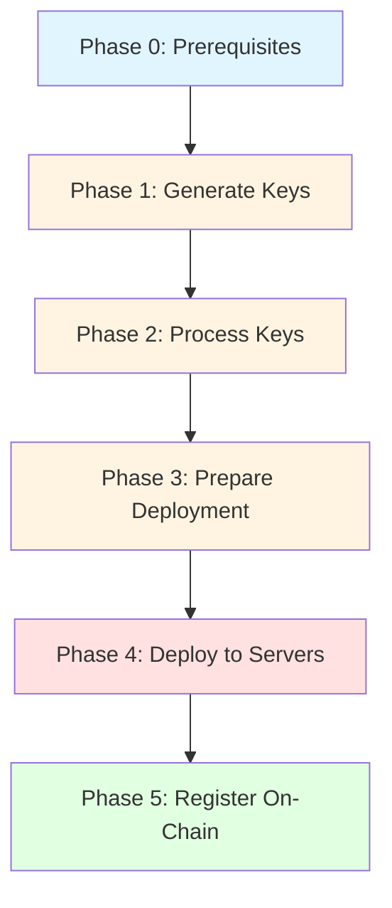

# Aztec Validator Key Management - Operator Guide

This guide provides step-by-step instructions for generating, deploying, and registering new validator keys for your Aztec node infrastructure.

## Overview

The key management workflow consists of 5 phases that safely guide you from key generation to on-chain registration:



## Phases

| Phase                     | Description               | Location    | Tools          |
| ------------------------- | ------------------------- | ----------- | -------------- |
| **[Phase 0](phase-0.md)** | Prerequisites and setup   | Dev machine | N/A            |
| **[Phase 1](phase-1.md)** | Generate private keys     | Dev machine | `aztec` CLI    |
| **[Phase 2](phase-2.md)** | Process and validate keys | Dev machine | `aztec-butler` |
| **[Phase 3](phase-3.md)** | Prepare deployment files  | Dev machine | `aztec-butler` |
| **[Phase 4](phase-4.md)** | Deploy to validator nodes | Dev + Nodes | SSH/Ansible    |
| **[Phase 5](phase-5.md)** | Register keys on-chain    | Dev machine | `aztec-butler` |

## Quick Start

If you're already familiar with the process:

```bash
# Phase 1: Generate keys
aztec validator-keys generate --num-validators 2

# Phase 2: Process private keys
aztec-butler process-private-keys new-private-keys.json

# Phase 3: Prepare deployment
aztec-butler prepare-deployment \
  --production-keys prod-keyfile.json \
  --new-public-keys public-new-private-keys.json \
  --available-publishers available_publisher_addresses.json \
  --network mainnet

# Phase 3b: Fill coinbase addresses (if needed)
aztec-butler scrape-coinbases --network mainnet
aztec-butler fill-coinbases --network mainnet --keys-file mainnet-keys-A-v1.json

# Phase 4: Deploy to servers (manual/scripted)
# See phase-4.md for details

# Phase 5: Register on-chain
aztec-butler get-add-keys-to-staking-provider-calldata \
  --keystore-paths prod-keyfile.json
# Then submit the calldata to your multisig
```

## Important Notes

### Security

- **Private keys must be handled with extreme care**
- Always use secure storage (GCP Secret Manager, HSM, etc.)
- Never commit private keys to version control
- Delete private key files immediately after secure storage

### High Availability (HA)

If running multiple validator nodes with the same attesters:

- Multiple servers auto-detected from available_publishers file in Phase 3
- Each server gets a unique set of publishers
- See [Phase 3](phase-3.md) for HA setup details

### Publisher Addresses

Publishers are now managed per-server in `available_publisher_addresses.json`:

```json
{
  "A": ["0x1111...", "0x2222..."],
  "B": ["0x3333...", "0x4444..."],
  "C": ["0x5555..."]
}
```

- Server "A" is used for single-server deployments
- Server A/B/C/etc. are used for HA deployments
- **No publisher address can appear in multiple server arrays**

### Unified Keys File Format

Starting with this version, Aztec Butler uses a unified configuration format for deployment. Keys files are automatically named using the pattern: `[network]-keys-[serverId]-v[version].json`

For example: `mainnet-keys-A-v1.json`, `mainnet-keys-B-v2.json`

The monitoring server automatically discovers and loads all keys files for the configured network. See the [main README](../../README.md#configuration) for details about the unified configuration format.

## File Organization

Throughout the process, you'll work with these file types:

| File Type           | Extension | Contains                       | Security        |
| ------------------- | --------- | ------------------------------ | --------------- |
| Private keys        | `.json`   | Private keys, public keys      | 🔴 **CRITICAL** |
| Public keys         | `.json`   | Public keys only               | 🟡 Sensitive    |
| Production keyfile  | `.json`   | Public keys + web3signer URL   | 🟢 Safe         |
| Keys files          | `.json`   | `[network]-keys-[server]-v[N]` | 🟢 Safe         |
| Publisher addresses | `.json`   | Publisher addresses per server | 🟢 Safe         |
| Coinbase cache      | `.json`   | Cached coinbase mappings       | 🟢 Safe         |

## Getting Help

- For detailed steps, see individual phase documentation
- For troubleshooting, check the "Common Issues" section in each phase
- For aztec-butler command help: `aztec-butler <command> --help`

## Next Steps

Start with **[Phase 0: Prerequisites](phase-0.md)** to ensure your environment is properly set up.
