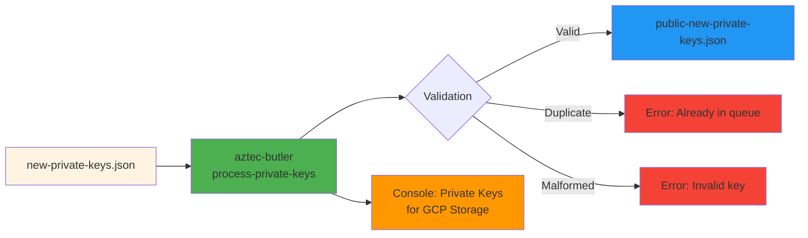

# Phase 2: Process Private Keys

Derive public keys, validate against on-chain data, and prepare for secure storage.

## Overview



**Location:** Dev machine  
**Tool:** `aztec-butler process-private-keys`  
**Duration:** < 1 minute

## Steps

### 1. Run Process Command

```bash
aztec-butler process-private-keys new-private-keys.json
```

**Optional flags:**

```bash
# Custom output filename
aztec-butler process-private-keys new-private-keys.json \
  --output custom-public-keys.json
```

### 2. Command Actions

The command automatically:

1. **Derives public keys** from private keys
   - ETH address from `attester.eth` private key
   - BLS public key from `attester.bls` private key

2. **Validates keys** are not malformed
   - Fails if any private key is invalid

3. **Checks provider queue** for duplicates
   - Queries on-chain staking provider queue
   - Fails if any attester address already exists

4. **Outputs private keys to console** (for GCP storage)
   - ⚠️ Console output contains sensitive data
   - Clear terminal after copying to secure storage

5. **Creates public keys file**
   - Default: `public-new-private-keys.json`
   - Contains only public keys (safe for deployment)

### 3. Verify Output

Check the generated public keys file:

```bash
cat public-new-private-keys.json | jq '.'
```

**Expected structure:**

```json
{
  "validators": [
    {
      "attester": {
        "eth": "0x5FAC75C9bD29CDf5599C74e31A8a88850a573748", // 20 bytes (address)
        "bls": "0x93b08f1aa2fa961575b4ed2b6222dc7576b5f8bf..." // 32 bytes (public key)
      },
      "feeRecipient": "0x0000000000000000000000000000000000000000"
    }
  ]
}
```

**Note:** No `coinbase` or `publisher` fields - these are added in Phase 3.

### 4. Store Private Keys Securely

**🔴 CRITICAL: Store private keys before proceeding**

`aztec-butler process-private-keys` now uploads attester (ETH + BLS) and publisher
private keys directly to **GCP Secret Manager** using Application Default
Credentials (Workload Identity or `gcloud auth application-default login`—no JSON
key file required). Secrets are created per key with incremental IDs and the public key appended:

```
web3signer-${network}-${keyType}-${att|pub}-${id}-${publicKey}
# Example sequence (0-based IDs, pubkey truncated):
# web3signer-sepolia-eth-att-0-0xabc...
# web3signer-sepolia-bls-att-0-0xdef...
# web3signer-sepolia-eth-pub-0-0x123...
# web3signer-sepolia-bls-att-1-0x456...
```

If a secret for a given public key already exists, the command skips uploading that key again.

Networks are limited to `eth-mainnet` and `sepolia`. Set `GCP_PROJECT_ID` (or rely on `GOOGLE_CLOUD_PROJECT`) so the command knows
which project to use. If GCP is unavailable in your environment, fall back to
manual storage (Vault, HSM, etc.):

```bash
vault kv put secret/aztec/validators/batch-2024-01 \
  keys=@new-private-keys.json
```

- [ ] Private keys stored in GCP Secret Manager / HSM / Vault
- [ ] Verified keys are retrievable
- [ ] Documented storage location and retrieval process

## Checklist

- [ ] Ran `aztec-butler process-private-keys new-private-keys.json`
- [ ] Command completed successfully (no errors)
- [ ] Generated `public-new-private-keys.json` file exists
- [ ] Public keys file contains correct number of validators
- [ ] Verified public keys are addresses (40 hex chars), not private keys
- [ ] **Stored private keys in secure storage**
- [ ] Verified keys are not already in provider queue
- [ ] Cleared terminal history of sensitive output

## File Locations After Phase 2

```
Dev Machine:
  ~/validator-keys-deployment/
  ├── prod-testnet-keyfile.json                # Existing
  ├── available_publisher_addresses.json       # Existing
  ├── new-private-keys.json                    # Phase 1
  └── public-new-private-keys.json             # ✅ New

Secure Storage (GCP/Vault):
  └── validator-keys-batch-YYYY-MM-DD          # ✅ New

Validator Nodes:
  /path/to/aztec/
  └── prod-testnet-keyfile.json                # Unchanged
```

## Common Issues

### Issue: "Attester already exists in provider queue"

**Cause:** One or more attesters are already registered on-chain.

**Solution:**

1. Identify which attesters are duplicates:

   ```bash
   # Check which attesters are duplicates (manually review error message)
   aztec-butler add-keys new-private-keys.json
   ```

2. Remove duplicates from `new-private-keys.json`
3. Re-run process command

### Issue: "Failed to process validator: missing feeRecipient"

**Cause:** Malformed private key file.

**Solution:** Regenerate keys in Phase 1, ensuring proper JSON structure.

### Issue: Cannot connect to Ethereum node

**Cause:** `ETHEREUM_NODE_URL` not configured or node unreachable.

**Solution:**

```bash
export ETHEREUM_NODE_URL=https://your-eth-node.com
# Or add to .env file
```

### Issue: "Provider ID not found"

**Cause:** `AZTEC_STAKING_PROVIDER_ADMIN_ADDRESS` not configured.

**Solution:**

```bash
export AZTEC_STAKING_PROVIDER_ADMIN_ADDRESS=0xYourAdminAddress
```

## Security Notes

### Console Output Contains Private Keys

The command outputs private keys to console for GCP storage. To clear:

```bash
# Linux/Mac
clear && history -c

# Or close the terminal window entirely
```

### Private Key File Cleanup

After secure storage is verified:

```bash
# Option 1: Securely delete (Linux)
shred -vfz -n 10 new-private-keys.json

# Option 2: Encrypt and delete original
gpg -c new-private-keys.json
rm new-private-keys.json
# Keep new-private-keys.json.gpg encrypted
```

## Validation Summary

After this phase, you should have:

| Item                   | Status | Verification                         |
| ---------------------- | ------ | ------------------------------------ |
| Public keys derived    | ✅     | Check `public-new-private-keys.json` |
| Private keys secured   | ✅     | Verify in secure storage             |
| No duplicates on-chain | ✅     | Command completed without errors     |
| Keys are valid         | ✅     | Command completed without errors     |

## Next Steps

Proceed to **[Phase 3: Prepare Deployment](phase-3.md)** to create deployment files.
