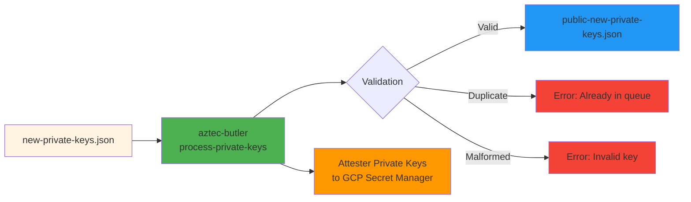

# Phase 2: Process Private Keys

Derive public keys, validate against on-chain data, and prepare for secure storage.

## Overview


```mermaid
flowchart LR
    A[new-private-keys.json] --> B[aztec-butler<br/>process-private-keys]
    B --> C{Validation}
    C -->|Valid| D[public-new-private-keys.json]
    C -->|Duplicate| E[Error: Already in queue]
    C -->|Malformed| F[Error: Invalid key]

    B --> G[Attester Private Keys<br/>to GCP Secret Manager]

    style A fill:#fff4e1
    style B fill:#4CAF50
    style D fill:#2196F3
    style E fill:#f44336
    style F fill:#f44336
    style G fill:#FF9800
```

**Location:** Dev machine  
**Tool:** `aztec-butler process-private-keys`  
**Duration:** < 1 minute

## Steps

### 1. Run Process Command

```bash
aztec-butler process-private-keys new-private-keys.json
```

By default, this uploads only attester keys (`attester.eth` and `attester.bls`) to GCP Secret Manager. Publisher private keys generated by `aztec validator-keys new` are ignored so the deployment can keep using publishers from the source files.

### 1b. Optional: Generate New Publisher Keys

If you want fresh publisher keys for funding and assignment, generate them directly in Butler:

```bash
aztec-butler new-publisher-keys -n 10 --network mainnet
```

This command:

- Generates `n` new publisher private keys
- Uploads them to GCP Secret Manager as `web3signer-<network>-eth-pub-<publicKey>`
- Writes publisher addresses to a JSON file
  - Default: `new-publisher-keys-<network>-<timestamp>.json`
  - Example: `new-publisher-keys-mainnet-20260501130000.json`
- Prints all addresses to fund

Custom output path for addresses:

```bash
aztec-butler new-publisher-keys -n 10 --output-addresses my-publishers.json --network mainnet
```

**Optional flags:**

```bash
# Custom output filename
aztec-butler process-private-keys new-private-keys.json \
  --output custom-public-keys.json

# Explicitly upload publisher private keys from the input file as well
# Not recommended when reusing existing/source publishers
aztec-butler process-private-keys new-private-keys.json \
  --upload-publisher-keys
```

### 2. Command Actions

The command automatically:

1. **Derives public keys** from private keys
   - ETH address from `attester.eth` private key
   - BLS public key from `attester.bls` private key

2. **Validates keys** are not malformed
   - Fails if any private key is invalid

3. **Checks provider queue** for duplicates
   - Queries on-chain staking provider queue
   - Fails if any attester address already exists

4. **Uploads attester private keys to GCP Secret Manager**
   - Stores `attester.eth` and `attester.bls`
   - Skips publisher private keys unless `--upload-publisher-keys` is passed

5. **Creates public keys file**
    - Default: `public-new-private-keys.json`
    - Contains attester public keys, fee recipient, and a zero-address publisher placeholder

### 3. Verify Output

Check the generated public keys file:

```bash
cat public-new-private-keys.json | jq '.'
```

**Expected structure:**

```json
{
  "validators": [
    {
      "attester": {
        "eth": "0x5FAC75C9bD29CDf5599C74e31A8a88850a573748", // 20 bytes (address)
        "bls": "0x93b08f1aa2fa961575b4ed2b6222dc7576b5f8bf..." // 32 bytes (public key)
      },
      "publisher": "0x0000000000000000000000000000000000000000",
      "feeRecipient": "0x0000000000000000000000000000000000000000"
    }
  ]
}
```

**Note:** `publisher` is a zero-address placeholder in this file. Real publisher addresses are assigned in Phase 3 from `available_publisher_addresses.json`. `coinbase` is not included here.

### 4. Store Private Keys Securely

**🔴 CRITICAL: Store private keys before proceeding**

`aztec-butler process-private-keys` uploads attester (ETH + BLS) private keys
directly to **GCP Secret Manager** using a Google service account
JSON key (no user re-auth needed). Point `GOOGLE_SERVICE_ACCOUNT_KEY_FILE` to the
key file path in your `*-base.env`; the same key is used for Sheets exports.
`GCP_PROJECT_ID` (or the `project_id` in the key) determines the target project.
Secrets stored in **GCP Secret Manager** are created per key with names based on role and public key:

```
web3signer-${network}-${keyType}-att-${id}-${publicKey}
# Example sequence (0-based IDs for attester secrets, pubkey truncated):
# web3signer-sepolia-eth-att-0-0xabc...
# web3signer-sepolia-bls-att-0-0xdef...
# web3signer-sepolia-bls-att-1-0x456...
```

Publisher private keys from the input file are not uploaded by default. If you intentionally pass `--upload-publisher-keys`, publisher secrets are named `web3signer-${network}-eth-pub-${publicKey}` and intentionally omit validator index/id semantics so the same publisher key can be reused across multiple validators. If a secret for a given public key already exists, the command skips uploading that key again.

Supported Butler networks for this command are `mainnet` and `testnet`; secret names use the Ethereum network derived from `ETHEREUM_CHAIN_ID`. Set `GCP_PROJECT_ID` (or rely on `GOOGLE_CLOUD_PROJECT`) so the command knows
which project to use. If GCP is unavailable in your environment, fall back to
manual storage (Vault, HSM, etc.):

```bash
vault kv put secret/aztec/validators/batch-2024-01 \
  keys=@new-private-keys.json
```

- **Notify web3signer:** After secrets are stored in GCP, the command POSTs to
  your web3signer instances so they pick up the new keys. Configure a
  comma-separated list of base URLs in your `*-base.env`; `/reload` is added
  automatically if omitted:

  ```
  WEB3SIGNER_URLS=https://sepolia-eth-web3signer,https://mainnet-eth-web3signer/reload
  ```

  Missing or failing URLs are logged; attester secrets are still uploaded.

- [ ] Attester private keys stored in GCP Secret Manager / HSM / Vault
- [ ] Verified keys are retrievable
- [ ] Documented storage location and retrieval process

## Checklist

- [ ] Ran `aztec-butler process-private-keys new-private-keys.json`
- [ ] Command completed successfully (no errors)
- [ ] Generated `public-new-private-keys.json` file exists
- [ ] Public keys file contains correct number of validators
- [ ] Verified public keys are addresses (40 hex chars), not private keys
- [ ] **Stored attester private keys in secure storage**
- [ ] Confirmed publisher source: existing `available_publisher_addresses.json`, `new-publisher-keys`, or explicit `--upload-publisher-keys`
- [ ] Verified keys are not already in provider queue

## File Locations After Phase 2

```
Dev Machine:
  ~/validator-keys-deployment/
  ├── prod-testnet-keyfile.json                # Existing
  ├── available_publisher_addresses.json       # Existing
  ├── new-private-keys.json                    # Phase 1
  └── public-new-private-keys.json             # ✅ New

Secure Storage (GCP/Vault):
  └── validator-keys-batch-YYYY-MM-DD          # ✅ New

Validator Nodes:
  /path/to/aztec/
  └── prod-testnet-keyfile.json                # Unchanged
```

## Common Issues

### Issue: "Attester already exists in provider queue"

**Cause:** One or more attesters are already registered on-chain.

**Solution:**

1. Identify which attesters are duplicates:

   ```bash
   # Check which attesters are duplicates (manually review error message)
   aztec-butler add-keys new-private-keys.json
   ```

2. Remove duplicates from `new-private-keys.json`
3. Re-run process command

### Issue: "Failed to process validator: missing feeRecipient"

**Cause:** Malformed private key file.

**Solution:** Regenerate keys in Phase 1, ensuring proper JSON structure.

### Issue: Cannot connect to Ethereum node

**Cause:** `ETHEREUM_NODE_URL` not configured or node unreachable.

**Solution:**

```bash
export ETHEREUM_NODE_URL=https://your-eth-node.com
# Or add to .env file
```

### Issue: "Provider ID not found"

**Cause:** `AZTEC_STAKING_PROVIDER_ADMIN_ADDRESS` not configured.

**Solution:**

```bash
export AZTEC_STAKING_PROVIDER_ADMIN_ADDRESS=0xYourAdminAddress
```

## Security Notes

### Private Key File Contains Private Keys

The command does not print private key material during normal operation, but `new-private-keys.json` still contains private keys. After secure storage is verified, clear shell history if you pasted secrets manually and remove the plaintext file.

```bash
# Linux/Mac
clear && history -c

# Or close the terminal window entirely
```

### Private Key File Cleanup

After secure storage is verified:

```bash
# Option 1: Securely delete (Linux)
shred -vfz -n 10 new-private-keys.json

# Option 2: Encrypt and delete original
gpg -c new-private-keys.json
rm new-private-keys.json
# Keep new-private-keys.json.gpg encrypted
```

## Validation Summary

After this phase, you should have:

| Item                   | Status | Verification                         |
| ---------------------- | ------ | ------------------------------------ |
| Public keys derived    | ✅     | Check `public-new-private-keys.json` |
| Attester keys secured  | ✅     | Verify in secure storage             |
| No duplicates on-chain | ✅     | Command completed without errors     |
| Keys are valid         | ✅     | Command completed without errors     |

## Next Steps

Proceed to **[Phase 3: Prepare Deployment](phase-3.md)** to create deployment files.
