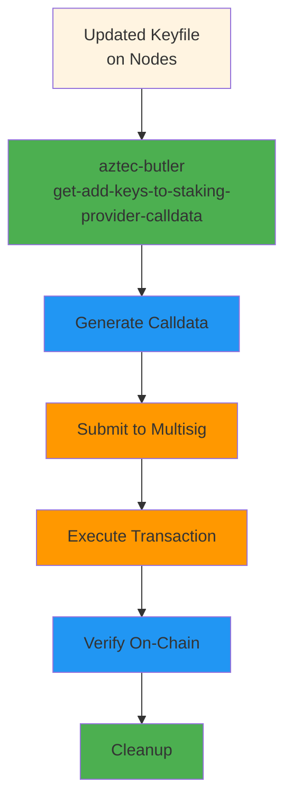

# Phase 5: Register On-Chain

Register the new validators with the staking provider contract on-chain.

## Overview



**Location:** Dev machine + Multisig wallet  
**Tool:** `aztec-butler` + Safe/multisig interface  
**Duration:** 5-30 minutes (depending on multisig approval process)

⚠️ **Important:** Only register keys **after** they are deployed to nodes and nodes are operational.

## Steps

### 1. Generate Registration Calldata

```bash
aztec-butler get-add-keys-to-staking-provider-calldata \
  --keystore-paths prod-testnet-keyfile.json
```

**What this does:**

- Reads all validators from keyfile
- Checks which validators are NOT yet in the provider queue
- Generates transaction calldata for adding new validators
- Displays formatted output with:
  - Contract address
  - Function signature
  - Calldata (hex)
  - List of validators being added

**Optional flags:**

```bash
# Use network-specific config
aztec-butler get-add-keys-to-staking-provider-calldata \
  --keystore-paths prod-testnet-keyfile.json \
  --network mainnet
```

### 2. Review Output

The command outputs something like:

```
=== Add Keys to Staking Provider Calldata ===

Staking Provider ID: 12
New validators to add: 2

Validators:
  1. 0x5FAC75C9bD29CDf5599C74e31A8a88850a573748
  2. 0x829B7234A1544C755a9F31Fa4812675F8E8A0BF3

Contract: 0x1234567890123456789012345678901234567890
Function: addKeys((address,bytes32,address)[])

Calldata:
0x1234567890abcdef...

✅ Calldata generated successfully
```

**Verify:**

- [ ] Validator count matches expected new validators
- [ ] Validator addresses are correct
- [ ] No unexpected validators included

### 3. Submit to Multisig

#### Using Safe (Gnosis Safe):

1. Navigate to Safe wallet interface
2. Go to "New Transaction" → "Contract Interaction"
3. Fill in transaction details:
   - **To:** (Contract address from output)
   - **Value:** 0 ETH
   - **Data:** (Paste the calldata hex string)

4. Review transaction:

   ```
   Contract: StakingProviderRegistry
   Function: addKeys
   Parameters:
     - validators: Array[2]
       - [0] (address, bytes32, address)
       - [1] (address, bytes32, address)
   ```

5. Submit transaction for approval

#### Using Hardware Wallet / Custom Multisig:

Follow your organization's multisig proposal process with:

- Contract address
- Calldata
- Value: 0 ETH
- Gas limit: Estimate or use conservative amount

### 4. Gather Approvals

- [ ] Submit for approval
- [ ] Notify other signers
- [ ] Track approval progress
- [ ] Execute transaction when threshold reached

### 5. Verify On-Chain Registration

After transaction is executed:

#### Check Provider Queue

```bash
# Query provider queue length
aztec-butler scrape-attester-status --network testnet --show-queued
```

Look for your new validators in the queue.

#### Verify Specific Attesters

```bash
# Check specific attester status
aztec-butler scrape-attester-status \
  --network testnet \
  --attester 0x5FAC75C9bD29CDf5599C74e31A8a88850a573748
```

Expected status: `IN_STAKING_PROVIDER_QUEUE`

#### Check All Attesters

```bash
aztec-butler scrape-attester-status \
  --network testnet \
  --show-active \
  --show-queued
```

Verify:

- Old validators: `ACTIVE` or appropriate status
- New validators: `IN_STAKING_PROVIDER_QUEUE`

### 6. Final Verification

- [ ] All new validators appear in provider queue on-chain
- [ ] Transaction confirmed on block explorer
- [ ] Private keys still securely stored in GCP/Vault
- [ ] Attester cache updated (optional)

### 7. Cleanup

```bash
cd ~/validator-keys-deployment

# Securely delete private keys file (if not already done)
shred -vfz -n 10 new-private-keys.json 2>/dev/null || echo "Already deleted"

# Keep these for records:
# - prod-testnet-keyfile.json (updated)
# - public-new-private-keys.json (public keys only - safe)

# Archive deployment files
mkdir -p archive/$(date +%Y-%m-%d)
mv public-new-private-keys.json archive/$(date +%Y-%m-%d)/
```

## Checklist

- [ ] Generated calldata with `get-add-keys-to-staking-provider-calldata`
- [ ] Reviewed validator list is correct
- [ ] Submitted transaction to multisig
- [ ] Transaction approved by required signers
- [ ] Transaction executed on-chain
- [ ] Verified validators in provider queue
- [ ] Confirmed transaction on block explorer
- [ ] Private keys securely stored (GCP/Vault)
- [ ] Private key files deleted from dev machine
- [ ] Attester cache updated (optional)
- [ ] Team notified of successful deployment

## Timeline

After registration, validators progress through these states:


**Typical timeline:**

- **Phase 5 completion → IN_STAKING_PROVIDER_QUEUE:** Immediate
- **IN_STAKING_PROVIDER_QUEUE → ROLLUP_ENTRY_QUEUE:** Variable (depends on protocol)
- **ROLLUP_ENTRY_QUEUE → ACTIVE:** Next epoch or activation period

Monitor progress with:

```bash
watch -n 60 'aztec-butler scrape-attester-status --network testnet --show-queued'
```

## Common Issues

### Issue: "Attester already in provider queue"

**Cause:** Validator was already registered previously.

**Solution:** This is normal if re-running the command. The command filters out duplicates automatically.

### Issue: Transaction reverts on-chain

**Possible causes:**

1. Validator already registered by another transaction
2. Invalid BLS public key
3. Gas limit too low

**Solution:**

```bash
# Check current queue state
aztec-butler scrape-attester-status --network testnet --show-queued

# Verify specific attester
# If already registered, no action needed
```

### Issue: Can't find validators in queue after transaction

**Symptoms:** Transaction succeeded but validators not visible.

**Possible causes:**

1. Transaction not yet confirmed
2. Wrong network being queried
3. Indexer lag

**Solution:**

```bash
# Wait for confirmation
# Check block explorer for transaction

# Verify on correct network
aztec-butler scrape-attester-status --network <correct-network> --show-queued

# Wait a few minutes for indexers to catch up
```

### Issue: Multisig rejection

**Cause:** Signers have concerns about the transaction.

**Solution:**

1. Review the validator list with team
2. Verify validators are operational on nodes
3. Confirm no duplicate registrations
4. Resubmit after addressing concerns

## Security Final Checks

Before considering deployment complete:

### Private Keys

- [ ] ✅ All private keys stored in GCP Secret Manager / HSM / Vault
- [ ] ✅ Private key files deleted from dev machine
- [ ] ✅ Terminal history cleared
- [ ] ✅ No private keys in Git history
- [ ] ✅ Backup encryption keys secured separately

### Access Control

- [ ] ✅ Only authorized personnel have access to private keys
- [ ] ✅ Access logs reviewed
- [ ] ✅ Rotation schedule documented (if applicable)

### Monitoring

- [ ] ✅ Attester cache includes new validators (optional)
- [ ] ✅ Monitoring dashboards updated
- [ ] ✅ Alert thresholds configured for new validators
- [ ] ✅ On-call team notified

## Success Criteria

Deployment is complete when:

1. ✅ New validators are registered in provider queue on-chain
2. ✅ Validator nodes are operational with new keys
3. ✅ Private keys securely stored and local copies deleted
4. ✅ Monitoring configured for all validators
5. ✅ Team has visibility into validator status
6. ✅ Documentation updated with new validator info

## Post-Deployment Monitoring

Continue to monitor for the next few epochs:

```bash
# Daily check
aztec-butler scrape-attester-status --network testnet --show-all

# Watch for state transitions
# NEW → IN_STAKING_PROVIDER_QUEUE → ROLLUP_ENTRY_QUEUE → ACTIVE
```

## Next Steps

- **Monitor validator progression** through activation stages
- **Set up alerts** for validator performance
- **Document deployment** in runbook
- **Schedule next key rotation** (if applicable)
- **Review and improve process** based on lessons learned

## Congratulations! 🎉

You have successfully:

- Generated new validator keys
- Deployed them to production nodes
- Registered them on-chain

The new validators will progress through the queue and become active according to the protocol schedule.
