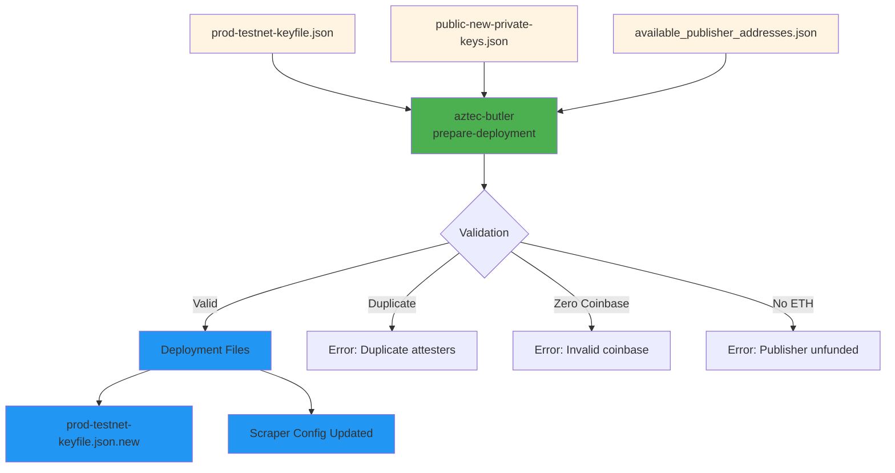

# Phase 3: Prepare Deployment

Create deployment-ready keyfiles with publisher assignments and update monitoring configuration.

## Overview



**Location:** Dev machine  
**Tool:** `aztec-butler prepare-deployment`  
**Duration:** 1-2 minutes

## Steps

### 1. Basic Deployment (Single Server)

```bash
aztec-butler prepare-deployment \
  --production-keys prod-testnet-keyfile.json \
  --new-public-keys public-new-private-keys.json \
  --available-publishers available_publisher_addresses.json
```

**This command:**

- Merges existing and new validators
- Assigns publishers from server "A"
- Validates all inputs
- Creates `prod-testnet-keyfile.json.new`
- Updates scraper config

### 2. High Availability Deployment (Multiple Servers)

```bash
aztec-butler prepare-deployment \
  --production-keys prod-testnet-keyfile.json \
  --new-public-keys public-new-private-keys.json \
  --available-publishers available_publisher_addresses.json \
  --high-availability-count 3
```

**This creates 3 files:**

- `A_prod-testnet-keyfile.json.new` (uses publishers from server A)
- `B_prod-testnet-keyfile.json.new` (uses publishers from server B)
- `C_prod-testnet-keyfile.json.new` (uses publishers from server C)

All files contain **the same validators** but **different publishers**.

### 3. Verify Output Files

#### Single Server:

```bash
# Check validator count
jq '.validators | length' prod-testnet-keyfile.json.new

# Verify all validators have publishers
jq '.validators[] | select(.publisher == null)' prod-testnet-keyfile.json.new
# Should output nothing
```

#### High Availability:

```bash
# Verify all files have same validators
diff <(jq '.validators[].attester.eth' A_prod-testnet-keyfile.json.new | sort) \
     <(jq '.validators[].attester.eth' B_prod-testnet-keyfile.json.new | sort)
# Should show no differences

# Verify different publishers
diff <(jq '.validators[].publisher' A_prod-testnet-keyfile.json.new | sort) \
     <(jq '.validators[].publisher' B_prod-testnet-keyfile.json.new | sort)
# Should show differences
```

### 4. Review Scraper Config

The command automatically updates the scraper config:

```bash
# Check config location (shown in command output)
cat ~/.local/share/aztec-butler/<network>-scrape-config.json | jq '.'
```

**Verify:**

- All attesters present (old + new)
- Publishers array contains unique addresses
- New attesters have `lastSeenState: "NEW"`
- Version is `"1.1"`

## Command Validations

The command performs these checks automatically:

### ✅ Duplicate Detection

- Checks for duplicate attesters across existing and new keys
- **Fails if duplicates found**

### ✅ Coinbase Validation

- Ensures no explicit zero-address coinbases in existing validators
- **Fails if any existing validator has explicit `0x0000...` coinbase**
- Missing coinbase (undefined) is OK for new validators

### ✅ Publisher Funding

- Queries ETH balance for all publishers
- **Fails if any publisher has 0 ETH**
- **Warns if any publisher has < `MIN_ETH_PER_ATTESTER` ETH**

### ✅ High Availability Validation

- Ensures no publisher address appears in multiple server arrays
- Ensures sufficient servers configured for requested HA count
- **Fails if conflicts detected**

## Checklist

- [ ] Ran prepare-deployment command successfully
- [ ] No validation errors or warnings
- [ ] Deployment file(s) created:
  - [ ] `prod-testnet-keyfile.json.new` (single server), OR
  - [ ] `A_prod-testnet-keyfile.json.new`, `B_...`, `C_...` (HA)
- [ ] Verified validator count matches expected (old + new)
- [ ] Verified all validators have publisher addresses assigned
- [ ] Verified publishers have sufficient ETH balance
- [ ] Scraper config updated successfully
- [ ] Reviewed scraper config contains all attesters

## File Locations After Phase 3

### Single Server:

```
Dev Machine:
  ~/validator-keys-deployment/
  ├── prod-testnet-keyfile.json                # Existing
  ├── available_publisher_addresses.json       # Existing
  ├── new-private-keys.json                    # Phase 1 (can delete after secure storage)
  ├── public-new-private-keys.json             # Phase 2
  └── prod-testnet-keyfile.json.new            # ✅ New - Ready to deploy

Scraper Config:
  ~/.local/share/aztec-butler/
  └── <network>-scrape-config.json             # ✅ Updated

Validator Node:
  /path/to/aztec/
  └── prod-testnet-keyfile.json                # Unchanged (will update in Phase 4)
```

### High Availability:

```
Dev Machine:
  ~/validator-keys-deployment/
  ├── prod-testnet-keyfile.json                # Existing
  ├── available_publisher_addresses.json       # Existing
  ├── public-new-private-keys.json             # Phase 2
  ├── A_prod-testnet-keyfile.json.new          # ✅ New - Deploy to Server A
  ├── B_prod-testnet-keyfile.json.new          # ✅ New - Deploy to Server B
  └── C_prod-testnet-keyfile.json.new          # ✅ New - Deploy to Server C
```

## Common Issues

### Issue: "Duplicate attester addresses found"

**Cause:** Attester already exists in production keyfile.

**Solution:**

1. Check which attesters are duplicates (shown in error)
2. Remove from `public-new-private-keys.json`
3. Re-run prepare-deployment

### Issue: "Zero-address coinbase found"

**Cause:** Existing validator has explicit `"coinbase": "0x0000..."`

**Solution:** This is a safety check. Options:

1. Set proper coinbase in production keyfile first
2. Or remove the validator if it's no longer active

### Issue: "Publisher has 0 ETH balance"

**Cause:** Publisher address not funded.

**Solution:**

```bash
# Fund the publisher address
# Then re-run prepare-deployment
```

### Issue: "Server A not found in available publishers"

**Cause:** Publisher file doesn't have server "A" key.

**Solution:** Ensure publisher file has correct structure:

```json
{
  "A": ["0x111...", "0x222..."]
}
```

### Issue: "Not enough servers for HA count"

**Cause:** HA count exceeds available servers in publisher file.

**Example:** `--high-availability-count 3` but file only has A and B.

**Solution:**

- Add server C to publisher file, OR
- Reduce `--high-availability-count` to 2

### Issue: "Publisher addresses shared between servers"

**Cause:** Same address appears in multiple server arrays.

**Solution:** Ensure each publisher address appears in only one server array:

```json
{
  "A": ["0x111..."],
  "B": ["0x222..."] // ✅ Different from A
}
```

## Publisher Distribution

Publishers are assigned round-robin across validators:

**Example with 5 validators and 3 publishers:**

```
Validator 0: Publisher 0
Validator 1: Publisher 1
Validator 2: Publisher 2
Validator 3: Publisher 0  (wraps around)
Validator 4: Publisher 1
```

This ensures even distribution of publishing load.

## Next Steps

Proceed to **[Phase 4: Deploy to Servers](phase-4.md)** to distribute files to validator nodes.
