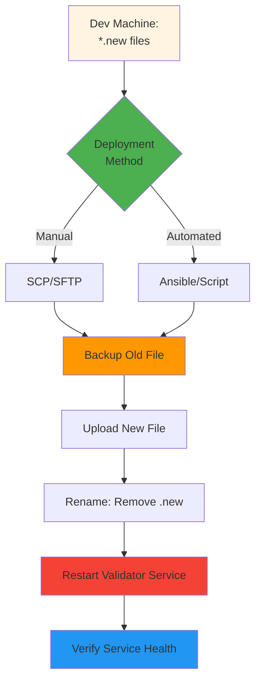

# Phase 4: Deploy to Servers

Distribute the new keyfiles to validator nodes and restart services to activate the new keys.

## Overview



**Location:** Dev machine → Validator nodes  
**Tools:** SSH, SCP, Ansible, or custom deployment scripts  
**Duration:** 5-15 minutes (depending on method and node count)

⚠️ **Important:** This phase involves service restarts. Plan accordingly for minimal disruption.

## Prerequisites

Before deploying:

- [ ] All deployment files from Phase 3 are ready
- [ ] SSH access to all validator nodes configured
- [ ] Node restart procedure documented
- [ ] Maintenance window scheduled (if required)
- [ ] Backup and rollback plan prepared

## Single Server Deployment

### Method 1: Manual SCP (Simple, Low Scale)

```bash
# 1. Backup existing keyfile on node
ssh validator-node "cp /path/to/aztec/prod-testnet-keyfile.json \
  /path/to/aztec/prod-testnet-keyfile.json.backup-$(date +%Y%m%d-%H%M%S)"

# 2. Upload new keyfile
scp prod-testnet-keyfile.json.new \
  validator-node:/path/to/aztec/prod-testnet-keyfile.json.new

# 3. SSH into node and finalize
ssh validator-node

# On the node:
cd /path/to/aztec
mv prod-testnet-keyfile.json.new prod-testnet-keyfile.json
systemctl restart aztec-validator  # Or your service name

# 4. Verify service started
systemctl status aztec-validator
journalctl -u aztec-validator -f  # Watch logs
```

### Method 2: Ansible Playbook (Automated, Scalable)

Create `deploy-keyfile.yml`:

```yaml
---
- name: Deploy Aztec Validator Keyfile
  hosts: validator_nodes
  become: yes
  vars:
    keyfile_path: /path/to/aztec/prod-testnet-keyfile.json
    source_file: prod-testnet-keyfile.json.new

  tasks:
    - name: Backup existing keyfile
      copy:
        src: "{{ keyfile_path }}"
        dest: "{{ keyfile_path }}.backup-{{ ansible_date_time.iso8601_basic_short }}"
        remote_src: yes

    - name: Upload new keyfile
      copy:
        src: "{{ source_file }}"
        dest: "{{ keyfile_path }}"
        mode: "0600"
        owner: aztec
        group: aztec

    - name: Restart validator service
      systemd:
        name: aztec-validator
        state: restarted

    - name: Wait for service to be active
      systemd:
        name: aztec-validator
        state: started
      register: service_status
      until: service_status.status.ActiveState == "active"
      retries: 5
      delay: 10

    - name: Verify service health
      command: systemctl status aztec-validator
      register: service_check

    - name: Display service status
      debug:
        var: service_check.stdout_lines
```

Run the playbook:

```bash
ansible-playbook -i inventory deploy-keyfile.yml
```

## High Availability Deployment

For HA setups, deploy different files to each server:

### Manual Deployment

```bash
# Server A
scp A_prod-testnet-keyfile.json.new \
  server-a:/path/to/aztec/prod-testnet-keyfile.json.new

# Server B
scp B_prod-testnet-keyfile.json.new \
  server-b:/path/to/aztec/prod-testnet-keyfile.json.new

# Server C
scp C_prod-testnet-keyfile.json.new \
  server-c:/path/to/aztec/prod-testnet-keyfile.json.new

# Then finalize each server as shown in single server method
```

### Ansible for HA

```yaml
---
- name: Deploy Aztec Validator Keyfiles (HA)
  hosts: validator_nodes
  become: yes
  vars:
    keyfile_path: /path/to/aztec/prod-testnet-keyfile.json

  tasks:
    - name: Determine source file based on server group
      set_fact:
        source_file: "{{ inventory_hostname | regex_replace('.*-([A-Z])$', '\\1') }}_prod-testnet-keyfile.json.new"

    - name: Backup existing keyfile
      copy:
        src: "{{ keyfile_path }}"
        dest: "{{ keyfile_path }}.backup-{{ ansible_date_time.iso8601_basic_short }}"
        remote_src: yes

    - name: Upload appropriate keyfile for this server
      copy:
        src: "{{ source_file }}"
        dest: "{{ keyfile_path }}"
        mode: "0600"
        owner: aztec
        group: aztec

    # ... rest same as single server
```

## Deployment Checklist

### Pre-Deployment

- [ ] Verified deployment files are correct and complete
- [ ] Backup strategy prepared
- [ ] Rollback plan documented
- [ ] Team notified of maintenance window (if applicable)

### During Deployment

- [ ] Backed up existing keyfile on each node
- [ ] Uploaded new keyfile(s) to correct server(s)
- [ ] Renamed `.new` files to active filename
- [ ] Restarted validator service(s)

### Post-Deployment

- [ ] Verified service is running on all nodes
- [ ] Checked logs for errors
- [ ] Confirmed validators are operational
- [ ] Cleaned up `.new` files from dev machine
- [ ] Cleaned up temporary files (optional)

## File Locations After Phase 4

```
Dev Machine:
  ~/validator-keys-deployment/
  ├── prod-testnet-keyfile.json                # Original (keep for reference)
  ├── public-new-private-keys.json             # Phase 2
  └── prod-testnet-keyfile.json.new            # Can delete after successful deployment

  # HA deployments also have:
  ├── A_prod-testnet-keyfile.json.new          # Can delete
  ├── B_prod-testnet-keyfile.json.new          # Can delete
  └── C_prod-testnet-keyfile.json.new          # Can delete

Validator Node(s):
  /path/to/aztec/
  ├── prod-testnet-keyfile.json                # ✅ Updated with new validators
  └── prod-testnet-keyfile.json.backup-*       # ✅ Backup of old file
```

## Verification Steps

### 1. Check Service Status

```bash
ssh validator-node "systemctl status aztec-validator"
```

Expected: `Active: active (running)`

### 2. Check Logs

```bash
ssh validator-node "journalctl -u aztec-validator -n 50"
```

Look for:

- ✅ Service started successfully
- ✅ Keys loaded
- ✅ No errors about keyfile format
- ❌ Connection errors
- ❌ Invalid key errors

### 3. Verify Validator Count

```bash
ssh validator-node "jq '.validators | length' /path/to/aztec/prod-testnet-keyfile.json"
```

Should match: (old validators) + (new validators)

### 4. Test Validator Operation

Monitor for a few epochs to ensure validators are participating normally.

## Common Issues

### Issue: Service fails to start after deployment

**Symptoms:**

- `systemctl status` shows `failed` or `inactive`
- Logs show JSON parse errors

**Cause:** Malformed keyfile (corruption during transfer)

**Solution:**

```bash
# Check file integrity
ssh validator-node "jq '.' /path/to/aztec/prod-testnet-keyfile.json"

# If invalid, restore backup
ssh validator-node "cp /path/to/aztec/prod-testnet-keyfile.json.backup-* \
  /path/to/aztec/prod-testnet-keyfile.json"

# Restart service
ssh validator-node "systemctl restart aztec-validator"

# Re-upload correct file
```

### Issue: Wrong keyfile deployed to wrong server (HA)

**Symptoms:** In HA setup, server A has B's publishers

**Solution:**

```bash
# Restore backup
ssh server-a "cp /path/to/aztec/prod-testnet-keyfile.json.backup-* \
  /path/to/aztec/prod-testnet-keyfile.json"

# Deploy correct file
scp A_prod-testnet-keyfile.json.new \
  server-a:/path/to/aztec/prod-testnet-keyfile.json

# Restart
ssh server-a "systemctl restart aztec-validator"
```

### Issue: File permissions incorrect

**Symptoms:**

- Service can't read keyfile
- Logs show permission denied

**Solution:**

```bash
ssh validator-node "chown aztec:aztec /path/to/aztec/prod-testnet-keyfile.json"
ssh validator-node "chmod 600 /path/to/aztec/prod-testnet-keyfile.json"
ssh validator-node "systemctl restart aztec-validator"
```

### Issue: Service won't restart cleanly

**Solution:**

```bash
# Force stop
ssh validator-node "systemctl stop aztec-validator"
ssh validator-node "pkill -9 aztec"  # If necessary

# Start fresh
ssh validator-node "systemctl start aztec-validator"
```

## Rollback Procedure

If deployment causes issues:

```bash
# 1. Stop service
ssh validator-node "systemctl stop aztec-validator"

# 2. Restore backup
ssh validator-node "cp /path/to/aztec/prod-testnet-keyfile.json.backup-* \
  /path/to/aztec/prod-testnet-keyfile.json"

# 3. Restart service
ssh validator-node "systemctl start aztec-validator"

# 4. Verify
ssh validator-node "systemctl status aztec-validator"
```

## Cleanup (Optional)

After successful deployment and verification:

```bash
# On dev machine
cd ~/validator-keys-deployment
rm *.new  # Remove deployment files
rm new-private-keys.json.gpg  # After keys are in GCP (keep encrypted backup elsewhere)

# On validator nodes (keep backups for 30 days)
ssh validator-node "find /path/to/aztec -name '*.backup-*' -mtime +30 -delete"
```

## Next Steps

After successful deployment, proceed to **[Phase 5: Register On-Chain](phase-5.md)** to register the new validators with the staking provider.
